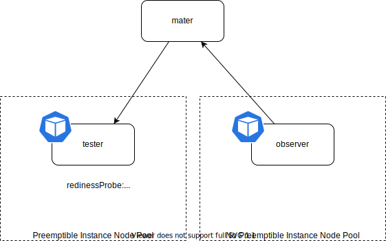
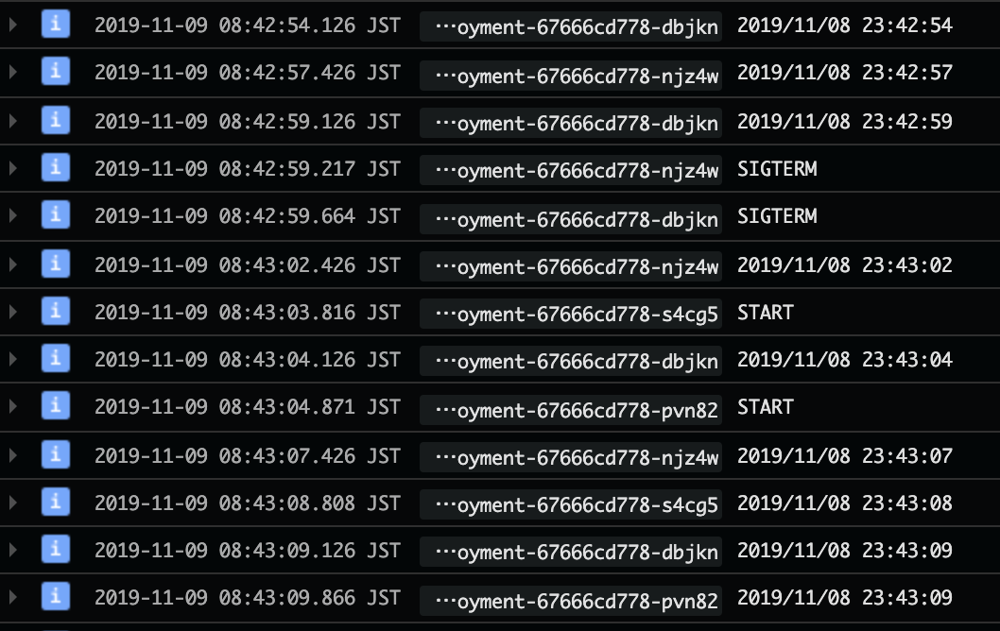
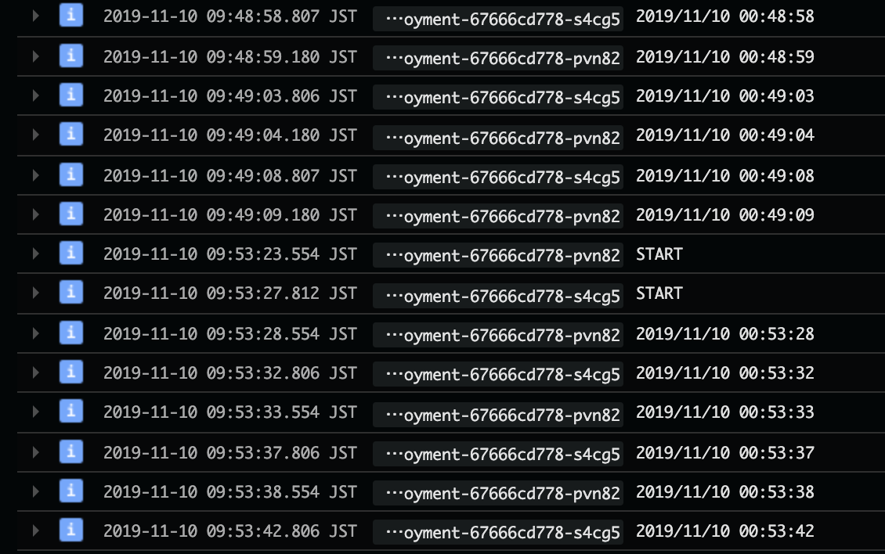
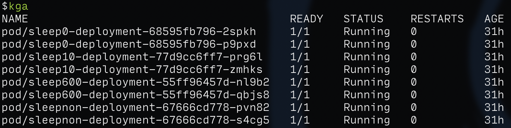
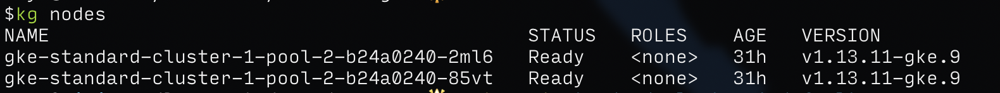

Test Preemptible Instance

## ノードプールを 0 にして、新しいノードプールに移動させた時の挙動

- Pod の ID は変わる
- SIGTERM が送られる
- SIGTERM が送られてから、すぐに別のノードで Pod が起動する

- 08:42:59 SIGTERM が送られる
- 08:43:03 次の Pod が作られる
- 08:43:27 前の Pod の最後のログ

## プリエンプティブインスタンスの挙動

- Node の ID は変わらない
- Pod の ID は変わらない
- SIGTERM は送られない
- いきなり KILL されてるっぽい
- 瞬断は防げない
- ノードプールに複数ノードあっても、ずらしてくれたりしない

`kubectl get pods`

`kubectl get nodes`

